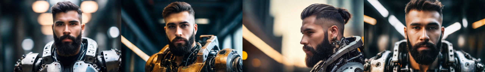
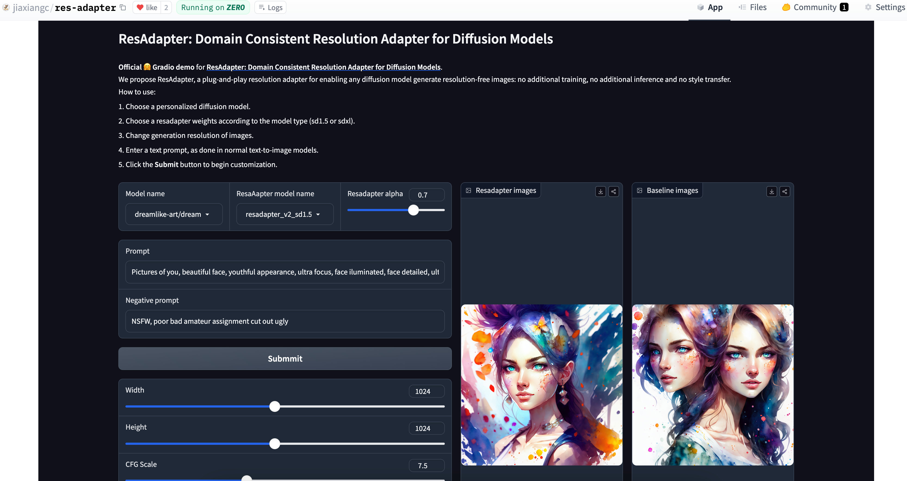

<div align="center">

<h1> ResAdapter: Domain Consistent Resolution Adapter for Diffusion Models  </h1>

Jiaxiang Cheng, Pan Xie*, Xin Xia, Jiashi Li, Jie Wu, Yuxi Ren, Huixia Li, Xuefeng Xiao, Min Zheng, Lean Fu (*Corresponding author)

AutoML, ByteDance Inc.

⭐ If ResAdapter is helpful to your images or projects, please help star this repo. Thanks! 🤗


<a href='https://res-adapter.github.io/'></a> 
<a href='https://arxiv.org/abs/2403.02084'></a> 
<a href='https://huggingface.co/papers/2403.02084'></a> 


[](https://huggingface.co/spaces/jiaxiangc/res-adapter)
[](https://replicate.com/bytedance/res-adapter)
[](https://github.com/jiaxiangc/ComfyUI-ResAdapter)
 

**We propose ResAdapter, a plug-and-play resolution adapter for enabling any diffusion model generate resolution-free images: no additional training, no additional inference and no style transfer.**


Comparison examples between resadapter and [dreamlike-diffusion-1.0](https://civitai.com/models/1274/dreamlike-diffusion-10).

</div>


## Release
- `[2024/12/10]` 🔥 ResAdapter is accepted by AAAI 2025.
- `[2024/04/07]` 🔥 We release the official [gradio space](https://huggingface.co/spaces/jiaxiangc/res-adapter) in Huggingface.
- `[2024/04/05]` 🔥 We release the [resadapter_v2 weights](https://huggingface.co/jiaxiangc/res-adapter).
- `[2024/03/30]` 🔥 We release the [ComfyUI-ResAdapter](https://github.com/jiaxiangc/ComfyUI-ResAdapter).
- `[2024/03/28]` 🔥 We release the [resadapter_v1 weights](https://huggingface.co/jiaxiangc/res-adapter).
- `[2024/03/04]` 🔥 We release the [arxiv paper](https://arxiv.org/abs/2403.02084).
<!-- - `[2024/03/12]` Code: 🔥 we release the [inference code](https://github.com/bytedance/res-adapter/blob/main/main.py). -->


## Quicktour

We provide a standalone [example code](quicktour.py) to help you quickly use resadapter with diffusion models.

<div align=center>




Comparison examples (640x384) between resadapter and [dreamshaper-xl-1.0](https://huggingface.co/Lykon/dreamshaper-xl-1-0). Top: with resadapter. Bottom: without resadapter.

</div>

```python
# pip install diffusers, transformers, accelerate, safetensors, huggingface_hub
import torch
from torchvision.utils import save_image
from safetensors.torch import load_file
from huggingface_hub import hf_hub_download
from diffusers import AutoPipelineForText2Image, DPMSolverMultistepScheduler

generator = torch.manual_seed(0)
prompt = "portrait photo of muscular bearded guy in a worn mech suit, light bokeh, intricate, steel metal, elegant, sharp focus, soft lighting, vibrant colors"
width, height = 640, 384

# Load baseline pipe
model_name = "lykon-models/dreamshaper-xl-1-0"
pipe = AutoPipelineForText2Image.from_pretrained(model_name, torch_dtype=torch.float16, variant="fp16").to("cuda")
pipe.scheduler = DPMSolverMultistepScheduler.from_config(pipe.scheduler.config, use_karras_sigmas=True, algorithm_type="sde-dpmsolver++")

# Inference baseline pipe
image = pipe(prompt, width=width, height=height, num_inference_steps=25, num_images_per_prompt=4, output_type="pt").images
save_image(image, f"image_baseline.png", normalize=True, padding=0)

# Load resadapter for baseline
resadapter_model_name = "resadapter_v1_sdxl"
pipe.load_lora_weights(
    hf_hub_download(repo_id="jiaxiangc/res-adapter", subfolder=resadapter_model_name, filename="pytorch_lora_weights.safetensors"), 
    adapter_name="res_adapter",
    ) # load lora weights
pipe.set_adapters(["res_adapter"], adapter_weights=[1.0])
pipe.unet.load_state_dict(
    load_file(hf_hub_download(repo_id="jiaxiangc/res-adapter", subfolder=resadapter_model_name, filename="diffusion_pytorch_model.safetensors")),
    strict=False,
    ) # load norm weights

# Inference resadapter pipe
image = pipe(prompt, width=width, height=height, num_inference_steps=25, num_images_per_prompt=4, output_type="pt").images
save_image(image, f"image_resadapter.png", normalize=True, padding=0)
```

## Download

### Models

We have released all resadapter weights, you can download resadapter models from [Huggingface](https://huggingface.co/jiaxiangc/res-adapter/tree/main). The following is our resadapter model card:

|Models  | Parameters | Resolution Range | Ratio Range | Links |
| --- | --- |--- | --- | --- |
|resadapter_v2_sd1.5| 0.9M | 128 <= x <= 1024 | 0.28 <= r <= 3.5 | [Download](https://huggingface.co/jiaxiangc/res-adapter/tree/main/resadapter_v2_sd1.5)|
|resadapter_v2_sdxl| 0.5M | 256 <= x <= 1536 | 0.28 <= r <= 3.5 | [Download](https://huggingface.co/jiaxiangc/res-adapter/tree/main/resadapter_v2_sdxl)|
|resadapter_v1_sd1.5| 0.9M | 128 <= x <= 1024 | 0.5 <= r <= 2 | [Download](https://huggingface.co/jiaxiangc/res-adapter/tree/main/resadapter_v1_sd1.5)|
|resadapter_v1_sd1.5_extrapolation| 0.9M | 512 <= x <= 1024 | 0.5 <= r <= 2  | [Download](https://huggingface.co/jiaxiangc/res-adapter/tree/main/resadapter_v1_sd1.5_extrapolation)|
|resadapter_v1_sd1.5_interpolation| 0.9M | 128 <= x <= 512 | 0.5 <= r <= 2  | [Download](https://huggingface.co/jiaxiangc/res-adapter/tree/main/resadapter_v1_sd1.5_interpolation)|
|resadapter_v1_sdxl| 0.5M | 256 <= x <= 1536 | 0.5 <= r <= 2  | [Download](https://huggingface.co/jiaxiangc/res-adapter/tree/main/resadapter_v1_sdxl) |
|resadapter_v1_sdxl_extrapolation| 0.5M | 1024 <= x <= 1536 | 0.5 <= r <= 2  | [Download](https://huggingface.co/jiaxiangc/res-adapter/tree/main/resadapter_v1_sdxl_extrapolation) |
|resadapter_v1_sdxl_interpolation| 0.5M | 256 <= x <= 1024 | 0.5 <= r <= 2  | [Download](https://huggingface.co/jiaxiangc/res-adapter/tree/main/resadapter_v1_sdxl_interpolation) |

Hint1: We update the resadapter name format according to [controlnet](https://github.com/lllyasviel/ControlNet-v1-1-nightly).

Hint2: If you want use resadapter with personalized diffusion models, you should download them from [CivitAI](https://civitai.com/).

Hint3: If you want use resadapter with ip-adapter, controlnet and lcm-lora, you should download them from [Huggingface](https://huggingface.co/jiaxiangc/res-adapter).

Hint4: Here is an [installation guidance](models/README.md) for preparing environment and downloading models.

## Inference

If you want generate images in our inference script, you should install dependency libraries and download related models according to [installation guidance](models/README.md). After filling in [example configs](configs), you can directly run this script.

```bash
python main.py --config /path/to/file
```

### ResAdapter with Personalized Models for Text to Image

<div align=center>


Comparison examples (960x1104) between resadapter and [dreamshaper-7](https://civitai.com/models/1274/dreamlike-diffusion-10). Top: with resadapter. Bottom: without resadapter.

</div>

### ResAdapter with ControlNet for Image to Image

<div align=center>


Comparison examples (840x1264) between resadapter and [lllyasviel/sd-controlnet-canny](https://huggingface.co/lllyasviel/sd-controlnet-canny). Top: with resadapter, bottom: without resadapter.

</div>

### ResAdapter with ControlNet-XL for Image to Image

<div align=center>


Comparison examples (336x504) between resadapter and [diffusers/controlnet-canny-sdxl-1.0](https://huggingface.co/diffusers/controlnet-canny-sdxl-1.0). Top: with resadapter, bottom: without resadapter.

</div>

### ResAdapter with IP-Adapter for Face Variance

<div align=center>


Comparison examples (864x1024) between resadapter and [h94/IP-Adapter](https://huggingface.co/h94/IP-Adapter). Top: with resadapter, bottom: without resadapter.


</div>


### ResAdapter with LCM-LoRA for Speeding up

<div align=center>


Comparison examples (512x512) between resadapter and [dreamshaper-xl-1.0](https://huggingface.co/Lykon/dreamshaper-xl-1-0) with [lcm-sdxl-lora](https://huggingface.co/latent-consistency/lcm-lora-sdxl). Top: with resadapter, bottom: without resadapter.


</div>

## Community Resource

### Gradio
- Replicate website: [bytedance/res-adapter](https://replicate.com/bytedance/res-adapter) by ([@Chenxi](https://github.com/chenxwh))
- Huggingface space: 
  - [jiaxiangc/res-adapter](https://huggingface.co/spaces/jiaxiangc/res-adapter) (official space)
  - [ameerazam08/Res-Adapter-GPU-Demo](https://huggingface.co/spaces/ameerazam08/Res-Adapter-GPU-Demo) by ([@Ameer Azam](https://github.com/AMEERAZAM08))

An text-to-image example about res-adapter in huggingface space. More information in [jiaxiangc/res-adapter](https://huggingface.co/spaces/jiaxiangc/res-adapter).


  
### ComfyUI
- [jiaxiangc/ComfyUI-ResAdapter](https://github.com/jiaxiangc/ComfyUI-ResAdapter) (official comfyui node)
- [blepping/ComfyUI-ApplyResAdapterUnet](https://github.com/blepping/ComfyUI-ApplyResAdapterUnet) by ([@blepping](https://github.com/blepping))

An text-to image example about ComfyUI-ResAdapter. More examples about lcm-lora, controlnet and ipadapter can be found in [ComfyUI-ResAdapter](https://github.com/jiaxiangc/ComfyUI-ResAdapter/tree/main).

https://github.com/jiaxiangc/ComfyUI-ResAdapter/assets/162297627/82453931-23de-4f72-8a9c-1053c4c8d81a

### WebUI

I am learning how to make webui extension.

## Local Gradio Demo

Run the following script:

```bash
# pip install peft, gradio, httpx==0.23.3
python app.py
```


## Usage Tips

1. If you are not satisfied with interpolation images, try to increase the alpha of resadapter to 1.0.
2. If you are not satisfied with extrapolate images, try to choose the alpha of resadapter in 0.3 ~ 0.7.
3. If you find the images with style conflicts, try to decrease the alpha of resadapter.
4. If you find resadapter is not compatible with other accelerate lora, try to decrease the alpha of resadapter to 0.5 ~ 0.7.

## Acknowledgements

- ResAdapter is developed by AutoML Team at ByteDance Inc, all copyright reserved.
- Thanks to the [HuggingFace](https://huggingface.co/) gradio team for their free GPU support!
- Thanks to the [IP-Adapter](https://huggingface.co/h94/IP-Adapter), [ControlNet](https://github.com/lllyasviel/ControlNet-v1-1-nightly), [LCM-LoRA](https://huggingface.co/latent-consistency/lcm-lora-sdxl) for their nice work.
- Thank [@Chenxi](https://github.com/chenxwh) and [@AMEERAZAM08](https://github.com/AMEERAZAM08) to provide gradio demos.
- Thank [@fengyuzzz](https://github.com/fengyuzzz) to support video demos in [ComfyUI-ResAdapter](https://github.com/jiaxiangc/ComfyUI-ResAdapter/tree/main).

## Star History
[](https://star-history.com/#bytedance/res-adapter&Date)

## Citation
If you find ResAdapter useful for your research and applications, please cite us using this BibTeX:
```
@article{cheng2024resadapter,
  title={ResAdapter: Domain Consistent Resolution Adapter for Diffusion Models},
  author={Cheng, Jiaxiang and Xie, Pan and Xia, Xin and Li, Jiashi and Wu, Jie and Ren, Yuxi and Li, Huixia and Xiao, Xuefeng and Zheng, Min and Fu, Lean},
  booktitle={arXiv preprint arxiv:2403.02084},
  year={2024}
}
```
For any question, please feel free to contact us via chengjiaxiang@bytedance.com or xiepan.01@bytedance.com.
