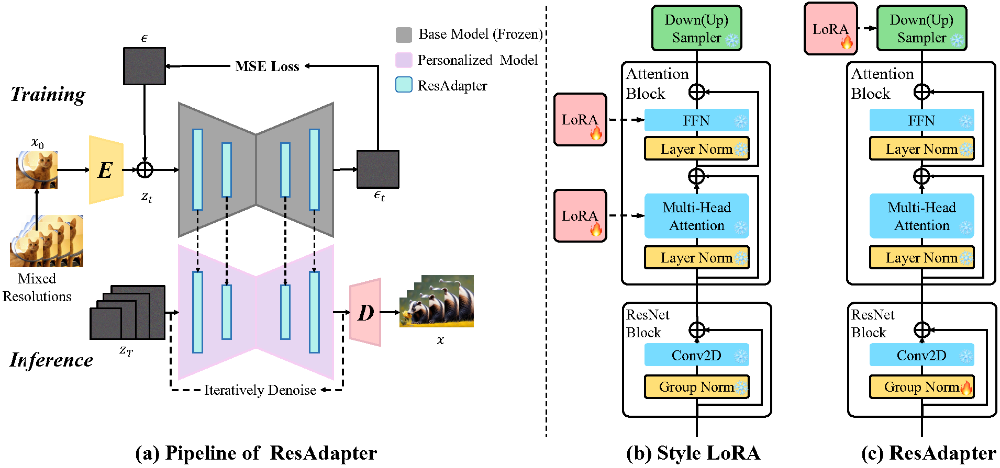
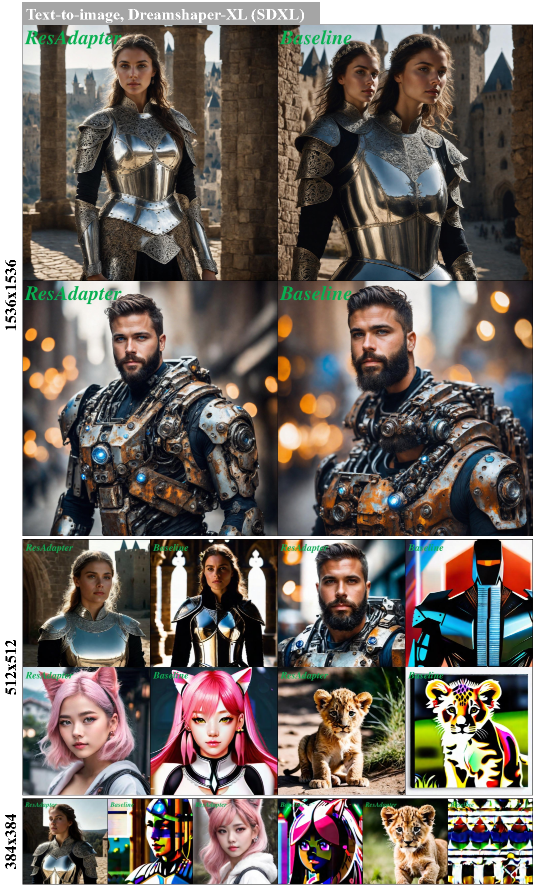
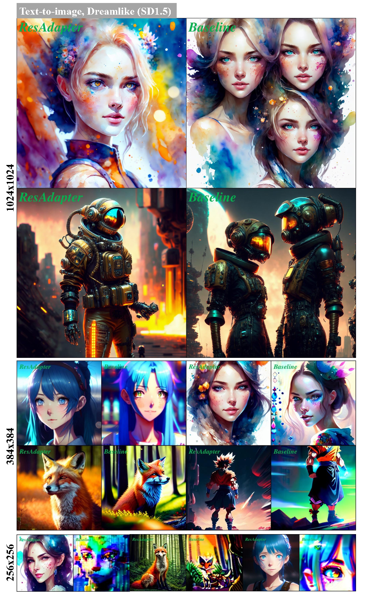
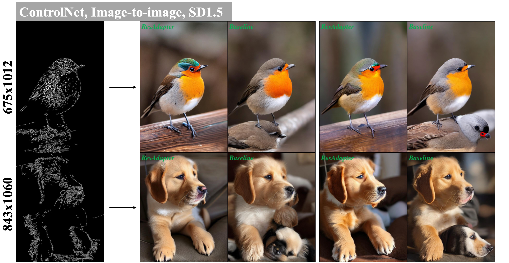
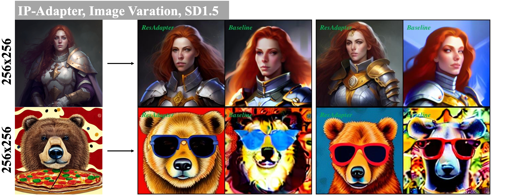
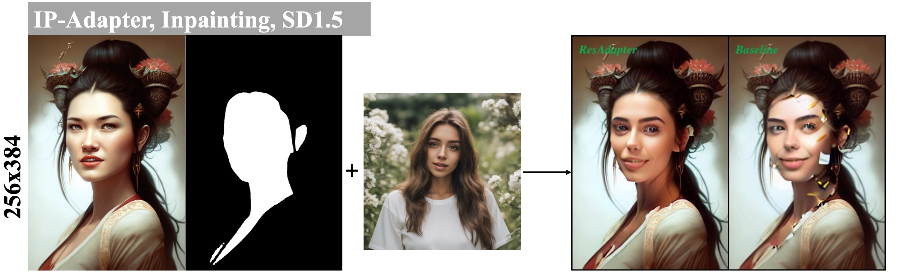
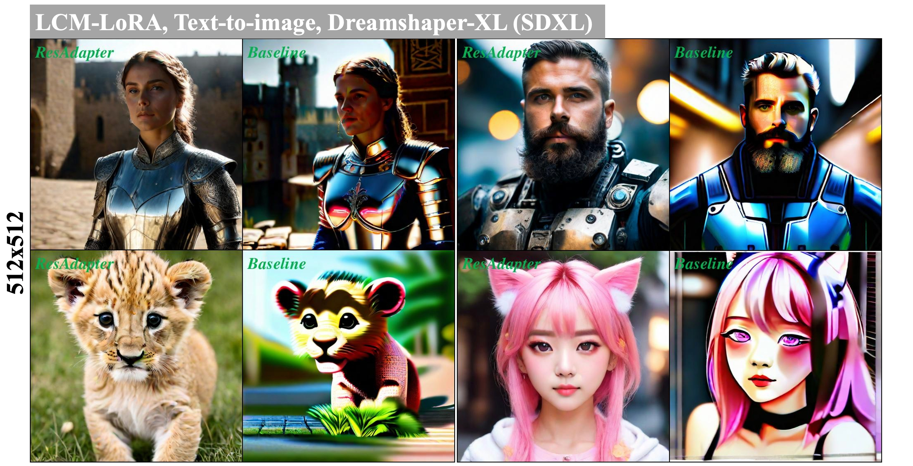

# ___***ResAdapter: Domain Consistent Resolution Adapter for Personalized Diffusion Models***___

<a href='https://ip-adapter.github.io'></a> 
<a href='https://arxiv.org/abs/2308.06721'></a> 
<a href='https://huggingface.co/h94/IP-Adapter'></a>
[](https://github.com/tencent-ailab/IP-Adapter/)


---


## Abstract

The advancement of text-to-image models (e.g., Stable Diffusion) and corresponding personalized technologies (e.g., DreamBooth and LoRA) enables individuals to generate high-quality, imaginative images.
However, they suffer from limitations in resolution extrapolation and interpolation: the quality of generated images above and below the training resolution significantly degrades. 
We attribute it to two reasons: the mismatch between the receptive field of UNet's convolution and the feature map size of images; the inability of UNet's normalization to adapt to the statistical distribution of feature maps in multi-resolution images.
To address this issue, we present a style domain-consistent Resolution Adapter (ResAdapter), which contains two components: resolution lora (ResLoRA) and resolution normalization (ResNorm).
ResLoRA can adaptively adjust the feature map size of images to match the receptive field of convolutions in the UNet's blocks, improving the fidelity of the images.
ResNorm can adapt to the statistical distribution of the feature map of multi-resolution images, improving the object layout.
Our experiments demonstrate that after learning the resolution priors, ResAdapter with only 0.51M can can be integrated into any personalized model to generate multi-resolution images without transforming the style domain. 
Our extensive experiments demonstrate that ResAdapter is compatible with other modules (e.g., LCM-LoRA, ControlNet and IP-Adapter), and can be integrated into other multi-resolution models (e.g., ElasticDiffusion) for efficiently generating 2048x2048 high-resolution images.



## Release
- [2024/2/21] 🔥 We release the code and models.


## Installation

```
# enter to res-adapter directory
cd res-adapter

# install dependency
pip install -r requirements.txt
```

## Models

### Download ResAdapter
|Models  | Parameters | Links |
| --- | --- |--- |
|SDv1.5 | 860M |[Download](https://huggingface.co/runwayml/stable-diffusion-v1-5)|
|SDXL1.0 |2.6B |[Download](https://huggingface.co/stabilityai/stable-diffusion-xl-base-1.0) | 
|ResAdapter| 0.74M | Download|
|ResAdapter-XL| 0.55M | Download|

### Download Personalized Models
|Models  | Structure Type |Domain Type |Links |
| --- | --- |--- |--- |
|RealisticVision|SDv1.5 |Realism | [Download](https://civitai.com/models/4201/realistic-vision-v60-b1)
|Dreamshaper|SDv1.5|2.5D | [Download](https://civitai.com/models/4384?modelVersionId=351306)
|DreamshaperXL|SDXL |2.5D | [Download](https://civitai.com/models/112902/dreamshaper-xl)
|AnimeartXL|SDXL |Anime | [Download](https://civitai.com/models/117259/anime-art-diffusion-xl)

## How to Use

### Personalized Models
```
python3 main.py --config configs/res_adapter/dreamshaper-xl.yaml
```



```
python3 main.py --config configs/res_adapter/dreamshaper-xl.yaml
```



### Other Modules

We support demos about ControlNet, IP-Adapter, LCM-LoRA.


You can download these modules below:
|Modules | Name | Type | Links |
| --- |--- | --- | --- |
|ControlNet| lllyasviel/sd-controlnet-canny |SD1.5 | [Download](https://huggingface.co/lllyasviel/sd-controlnet-canny)
|IP-Adapter| h94/IP-Adapter | SD1.5/SDXL | [Download](https://huggingface.co/h94/IP-Adapter)
|LCM-LoRA| latent-consistency/lcm-lora-sdv1-5 |SD1.5 | [Download](https://huggingface.co/latent-consistency/lcm-lora-sdv1-5)
|LCM-LoRA| latent-consistency/lcm-lora-sdxl | SDXL| [Download](https://huggingface.co/latent-consistency/lcm-lora-sdxl)

#### ControlNet
```
python3 main.py --config configs/res_adapter_controlnet/controlnet_image2image.yaml
```



#### IP-Adapter
```
python3 main.py --config configs/res_adapter_ip_adapter/ip_adapter_inpaint.yaml
```




#### LCM-LoRA
```
python3 main.py --config configs/res_adapter_lcmlora/dreamshaperxl_lcm_lora.yaml
```




**Best Practice**
- For interpolation (generating images below the training resolution), we recommend setting `adapter_alpha=1.0`. 
- For extrapolation (generating images above the training resolution), we recommend the following adapter_alpha settings: When the inference resolution is greater than 1.5x the training resolution, we recommend setting `0.2<adapter_alpha<0.6`. When the inference resolution is less than or equal to 1.5x the training resolution, we recommend setting `0.6< adapter_alpha<1.0`.
- We strongly recommend that you use the prompt corresponding to the personalized model, which helps to enhance the quality of the image.


## Citation
If you find ResAdapter useful for your research and applications, please cite using this BibTeX:
```bibtex
@article{cheng2024res-adapter,
  title={ResAdapter: Text Compatible Image Prompt Adapter for Text-to-Image Diffusion Models},
  author={Cheng, Jiaxiang and Xie, Pan and Xia, Xin and Li, Jiashi and Wu, Jie and Ren, Yuxi and Li, Huixia and Xiao, Xuefeng},
  booktitle={arXiv preprint arxiv:2308.06721},
  year={2024}
}
```
