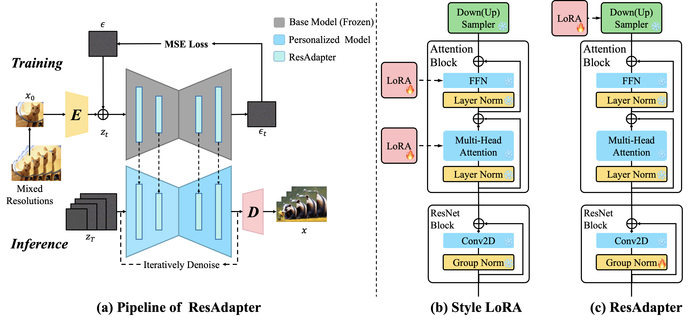
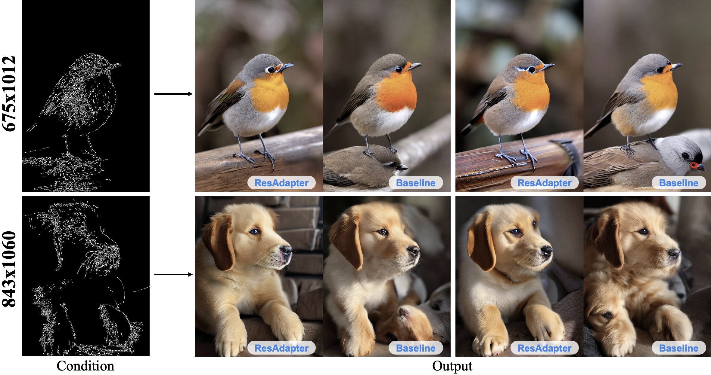
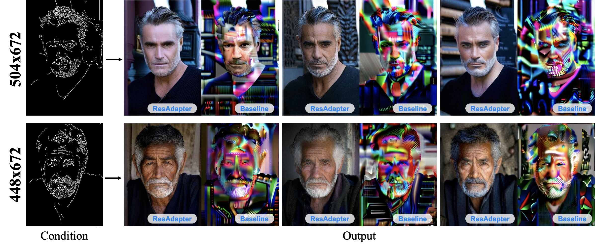
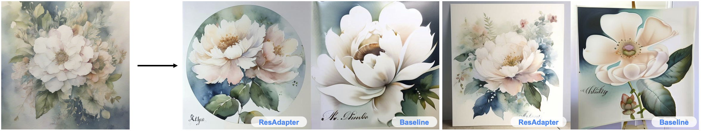
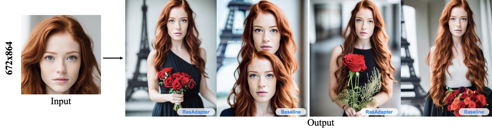
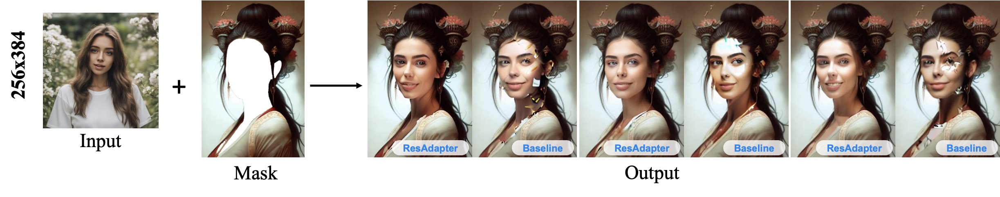
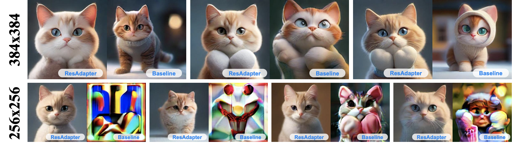

# ___***ResAdapter: Domain Consistent Resolution Adapter for Diffusion Models***___

<a href='https://res-adapter.github.io/'></a> 
<a href=''></a> 
<a href='https://huggingface.co/jiaxiangc/res-adapter'></a>
<!-- [](https://github.com/bytedance/res-adapter/) -->


---


## Abstract

Recent advancement in text-to-image models (e.g., Stable Diffusion) and corresponding personalized technologies (e.g., DreamBooth and LoRA) enables individuals to generate high-quality and imaginative images.
However, they often suffer from limitations when generating images with resolutions outside of their trained domain.
To overcome this limitation, we present the Resolution Adapter (ResAdapter), a domain-consistent adapter designed for diffusion models to generate images with unrestricted resolutions and aspect ratios.
Unlike other multi-resolution generation methods that process images of static resolution with complex post-process operations, ResAdapter directly generates images with the dynamical resolution.  
% This perspective enables the efficient inference without repeat denoising steps and complex post-process operations, thus eliminating the additional inference time.
Especially, after acquiring a deep understanding of pure resolution priors, ResAdapter trained on the general dataset, generates resolution-free images with personalized diffusion models while preserving their original style domain.
Comprehensive experiments demonstrate that ResAdapter with only 0.5M can process images with flexible resolutions for arbitrary diffusion models.
More extended experiments demonstrate that ResAdapter is compatible with other modules (e.g., ControlNet, IP-Adapter and LCM-LoRA) for images across a broad range of resolutions, and can be integrated into other multi-resolution model (e.g., ElasticDiffusion) for efficiently generating higher-resolution images.



## Release
- [2024/3/4] 🔥 We release the code and models.


## Installation

```
# enter to res-adapter directory
cd res-adapter

# install dependency
pip install -r requirements.txt
```

## Models

### Download ResAdapter
|Models  | Parameters | Versions | Links |
| --- | --- |--- | --- |
|SDv1.5 | 860M | --- |[Download](https://huggingface.co/runwayml/stable-diffusion-v1-5)|
|SDXL1.0 |2.6B | --- |[Download](https://huggingface.co/stabilityai/stable-diffusion-xl-base-1.0) | 
|ResAdapter-RI| 0.74M | Resolution Interpolation | [Download](https://huggingface.co/jiaxiangc/res-adapter)|
|ResAdapter-XL-RI| 0.55M | Resolution Interpolation | [Download](https://huggingface.co/jiaxiangc/res-adapter)|

### Download Personalized Models

|Models  | Structure Type |Domain Type |Links |
| --- | --- |--- |--- |
|RealisticVision|SDv1.5 |Realism | [Download](https://civitai.com/models/4201/realistic-vision-v60-b1)
|Dreamshaper|SDv1.5|2.5D | [Download](https://civitai.com/models/4384?modelVersionId=351306)
|Dreamlike| SDv1.5 | Fantasy | [Download](https://civitai.com/models/1274/dreamlike-diffusion-10)
|DreamshaperXL|SDXL |2.5D | [Download](https://civitai.com/models/112902/dreamshaper-xl)
|AnimeartXL|SDXL |Anime | [Download](https://civitai.com/models/117259/anime-art-diffusion-xl)

## How to Use

### Personalized Models
```
python3 main.py --config configs/res_adapter/dreamshaper-xl.yaml
```


### Other Modules

We support demos about ControlNet, IP-Adapter, LCM-LoRA.


You can download these modules below:

|Modules | Name | Type | Links |
| --- |--- | --- | --- |
|ControlNet| lllyasviel/sd-controlnet-canny |SD1.5 | [Download](https://huggingface.co/lllyasviel/sd-controlnet-canny)
|ControlNet| diffusers/controlnet-canny-sdxl-1.0 |SDXL | [Download](https://huggingface.co/diffusers/controlnet-canny-sdxl-1.0)
|IP-Adapter| h94/IP-Adapter | SD1.5/SDXL | [Download](https://huggingface.co/h94/IP-Adapter)
|LCM-LoRA| latent-consistency/lcm-lora-sdv1-5 |SD1.5 | [Download](https://huggingface.co/latent-consistency/lcm-lora-sdv1-5)
|LCM-LoRA| latent-consistency/lcm-lora-sdxl | SDXL| [Download](https://huggingface.co/latent-consistency/lcm-lora-sdxl)

#### ControlNet


```
python3 main.py --config configs/res_adapter_controlnet/controlnet_image2image.yaml
```

Image to image tasks for ControlNet.



```
python3 main.py --config configs/res_adapter_controlnet/controlnet_image2image.yaml
```

Image to image tasks for ControlNet-XL.




#### IP-Adapter
```
python3 main.py --config [config.path]
```


Image varations for IP-Adapter-XL.



Face varations for IP-Adapter.



Inpainting for IP-Adapter.





#### LCM-LoRA
```
python3 main.py --config configs/res_adapter_lcmlora/dreamshaperxl_lcm_lora.yaml
```



**Best Practice**
- For interpolation (generating images below the training resolution), we recommend setting `adapter_alpha=1.0`. 
- For extrapolation (generating images above the training resolution), we recommend the following adapter_alpha settings: When the inference resolution is greater than 1.5x the training resolution, we recommend setting `0.2<adapter_alpha<0.6`. When the inference resolution is less than or equal to 1.5x the training resolution, we recommend setting `0.6< adapter_alpha<1.0`.
- We strongly recommend that you use the prompt corresponding to the personalized model, which helps to enhance the quality of the image.


## Citation
If you find ResAdapter useful for your research and applications, please cite using this BibTeX:
```bibtex
@article{cheng2024res-adapter,
  title={ResAdapter: Domain Consistent Resolution Adapter for Diffusion Models},
  author={Cheng, Jiaxiang and Xie, Pan and Xia, Xin and Li, Jiashi and Wu, Jie and Ren, Yuxi and Li, Huixia and Xiao, Xuefeng and Zheng, Min and Fu, Lean},
  booktitle={arXiv preprint arxiv:2308.06721},
  year={2024}
}
```
