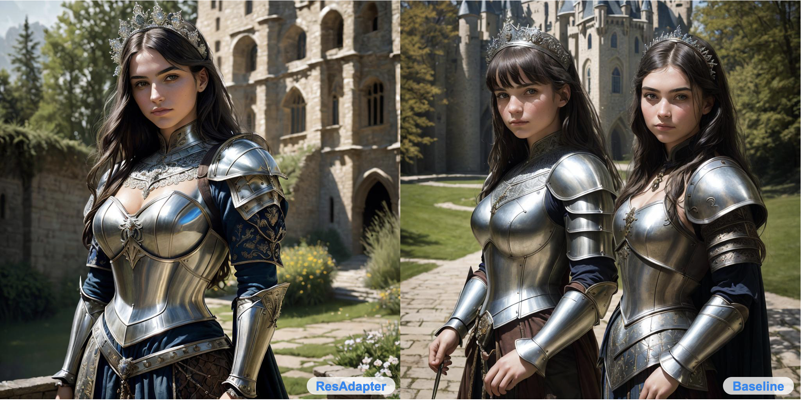
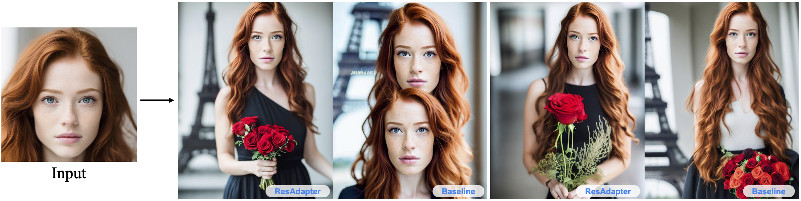
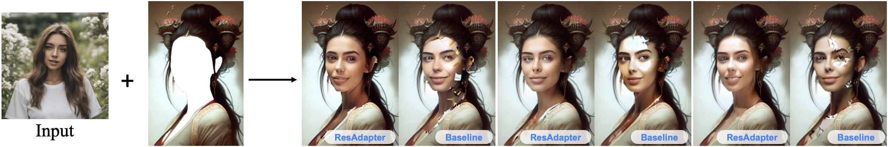
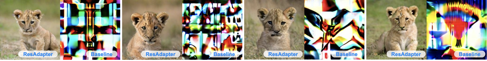

<div align="center">

<h1> ResAdapter: Domain Consistent Resolution Adapter for Diffusion Models  </h1>

Jiaxiang Cheng,
Pan Xie*,
Xin Xia,
Jiashi Li,
Jie Wu,
Yuxi Ren,
Huixia Li,
Xuefeng Xiao,
Min Zheng,
Lean Fu
(*Corresponding author)

AutoML, ByteDance Inc.


<a href='https://res-adapter.github.io/'></a> 
<a href='https://arxiv.org/abs/2403.02084'></a> 
<a href='https://huggingface.co/jiaxiangc/res-adapter'></a>


<strong> We propose ResAdapter, a plug-and-play resolution adapter for enabling diffusion models of arbitrary style domains to generate resolution-free images: no additional training, no additional inference and no style transfer.</strong>


</div>

<!-- ## Abstract -->

<!-- <div style="width: 100%; text-align: center; margin:auto;">
    
</div> -->

<!-- Recent advancement in text-to-image models (e.g., Stable Diffusion) and corresponding personalized technologies (e.g., DreamBooth and LoRA) enables individuals to generate high-quality and imaginative images.
However, they often suffer from limitations when generating images with resolutions outside of their trained domain.
To overcome this limitation, we present the Resolution Adapter (ResAdapter), a domain-consistent adapter designed for diffusion models to generate images with unrestricted resolutions and aspect ratios.
Unlike other multi-resolution generation methods that process images of static resolution with complex post-process operations, ResAdapter directly generates images with the dynamical resolution.  
Especially, after acquiring a deep understanding of pure resolution priors, ResAdapter trained on the general dataset, generates resolution-free images with personalized diffusion models while preserving their original style domain.
Comprehensive experiments demonstrate that ResAdapter with only 0.5M can process images with flexible resolutions for arbitrary diffusion models.
More extended experiments demonstrate that ResAdapter is compatible with other modules (e.g., ControlNet, IP-Adapter and LCM-LoRA) for images across a broad range of resolutions, and can be integrated into other multi-resolution model (e.g., ElasticDiffusion) for efficiently generating higher-resolution images. -->

## Release
- [2024/3/5] 🔥 We release the paper about [ResAdapter](https://arxiv.org/abs/2403.02084) to arxiv.
- [2024/3/4] 🔥 We release the code and models.


## Installation

```bash
# Step1: Enter to res-adapter directory
cd res-adapter

# Step2: Install dependency
pip install -r requirements.txt

# Step3: Download diffusion models, and make the directory structure as follows:
models
├── res_adapter
│   ├── res_adapter-v1.5
│   ├── res_adapter-xl
├── diffusion_models
│   ├── ...
├── controlnet
│   ├── ...
├── ip_adapter
│   ├── ...
└── lcm_lora
    └──  ...
```

## Download Models

### Download ResAdapter

We temporally provide resadapter-i, which support to generate lower-resolution images with high fidelity.

|Models  | Parameters | Resolution Range | Links |
| --- | --- |--- | --- |
|resadapter-v1.5-i| 0.9M | 128<= x <= 512 | [Download](https://huggingface.co/jiaxiangc/res-adapter)|
|resadapter-xl-i| 0.5M | 256 <= x <= 1024 | [Download](https://huggingface.co/jiaxiangc/res-adapter)|
|resadapter-v1.5| 0.9M | 128 <= x <= 1024 | Coming soon|
|resadapter-xl| 0.5M | 256 <= x <= 1536 | Coming soon|
<!-- |SDv1.5 | 860M | --- |[Download](https://huggingface.co/runwayml/stable-diffusion-v1-5)|
|SDXL1.0 |2.6B | --- |[Download](https://huggingface.co/stabilityai/stable-diffusion-xl-base-1.0) |  -->


<!-- |Dreamshaper|SDv1.5|2.5D | [Download](https://civitai.com/models/4384?modelVersionId=351306) -->


### Download Diffusion Models

We provide some personalized models for sampling style images with ResAdapter.
More personalized models can be found in [CivitAI](https://civitai.com/).


|Models  | Structure Type |Domain Type |Links |
| --- | --- |--- |--- |
| **Base model**
|SDv1.5 | - | General |[Download](https://huggingface.co/runwayml/stable-diffusion-v1-5)|
|SDXL1.0 |- | General |[Download](https://huggingface.co/stabilityai/stable-diffusion-xl-base-1.0) |
| **Personalized model**
|RealisticVision|SDv1.5 |Realism | [Download](https://civitai.com/models/4201/realistic-vision-v60-b1)
|Dreamlike| SDv1.5 | Fantasy | [Download](https://civitai.com/models/1274/dreamlike-diffusion-10)
|DreamshaperXL|SDXL |2.5D | [Download](https://civitai.com/models/112902/dreamshaper-xl)
|AnimeartXL|SDXL |Anime | [Download](https://civitai.com/models/117259/anime-art-diffusion-xl)

### Download other modules

We support demos about ControlNet, IP-Adapter, LCM-LoRA.

|Modules | Name | Type | Links |
| --- |--- | --- | --- |
|ControlNet| lllyasviel/sd-controlnet-canny |SD1.5 | [Download](https://huggingface.co/lllyasviel/sd-controlnet-canny)
|ControlNet| diffusers/controlnet-canny-sdxl-1.0 |SDXL | [Download](https://huggingface.co/diffusers/controlnet-canny-sdxl-1.0)
|IP-Adapter| h94/IP-Adapter | SD1.5/SDXL | [Download](https://huggingface.co/h94/IP-Adapter)
|LCM-LoRA| latent-consistency/lcm-lora-sdv1-5 |SD1.5 | [Download](https://huggingface.co/latent-consistency/lcm-lora-sdv1-5)
|LCM-LoRA| latent-consistency/lcm-lora-sdxl | SDXL| [Download](https://huggingface.co/latent-consistency/lcm-lora-sdxl)

## How to Inference

We provide simple scripts for sampling images of resadapter and baseline.

```bash
# Step1: Choose a task example of config file.
# Step2: Fill in "path, width, height and prompt".
# Step3: Run the following script.
python main.py --config [path.file]
```

### ResAdapter with diffusion models

We compare the image with 1024 x 1024 resolution generated by ResAdapter and baseline. Baseline means the personalized diffusion model. 




### ResAdapter with ControlNet

#### Image to image tasks for ControlNet.

We compare the **resolution extrapolation** results generated by ResAdapter and ControlNet-v1.5.


We compare the **resolution interpolation** results generated by ResAdapter and ControlNet-XL.


### ResAdapter with IP-Adapter


#### Image varations


#### Face varations for IP-Adapter



#### Inpainting for IP-Adapter




### ResAdapter with LCM-LoRA

We compare the **resolution interpolation** results generated by ResAdapter and baseline. We inference images with `step=4` and `cfg=1.0`.





**Best Practice**
- For interpolation (generating images below the training resolution), we recommend setting `adapter_alpha=1.0`. 
- For extrapolation (generating images above the training resolution), we recommend the following adapter_alpha settings: When the inference resolution is greater than 1.5x the training resolution, we recommend setting `0.2<adapter_alpha<0.6`. When the inference resolution is less than or equal to 1.5x the training resolution, we recommend setting `0.6< adapter_alpha<1.0`.
- We strongly recommend that you use the prompt corresponding to the personalized model, which helps to enhance the quality of the image.


## Citation
If you find ResAdapter useful for your research and applications, please cite using this BibTeX:
```bibtex
@article{cheng2024resadapter,
  title={ResAdapter: Domain Consistent Resolution Adapter for Diffusion Models},
  author={Cheng, Jiaxiang and Xie, Pan and Xia, Xin and Li, Jiashi and Wu, Jie and Ren, Yuxi and Li, Huixia and Xiao, Xuefeng and Zheng, Min and Fu, Lean},
  booktitle={arXiv preprint arxiv:2403.02084},
  year={2024}
}
```

